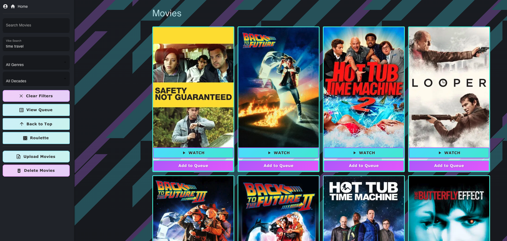

Streaming App — Firestick / Fire TV Guide
=========================================



Overview
--------
A private media server with React frontend and Node.js backend for streaming movies on Fire TV and desktop. Features include smart search, infinite scroll queue management, and HLS streaming with automatic English audio track selection.

Contents
--------
- Prerequisites
- Setup & Running
- Deployment
- Troubleshooting

Prerequisites
-------------
- Node.js 16+
- npm
- Firestick with Silk browser or desktop browser

Setup & Running
---------------

**Find your machine IP:**
```bash
ipconfig getifaddr en0
```

**Install dependencies:**
```bash
npm install
cd client && npm install && cd ..
```

**Create environment files:**

Root `.env`:
```
PORT=8080
TMDB_API_KEY=<your-tmdb-key>
OPENAI_API_KEY=<optional>
API_USER=admin
API_PASS=admin123
SECRET_KEY=your-secret-key
```

`client/.env`:
```
REACT_APP_API_BASE=http://<YOUR_MACHINE_IP>:8080
REACT_APP_USERNAME=admin
REACT_APP_PASSWORD=admin123
REACT_APP_SECRET_KEY=your-secret-key
```

**Start the app:**
```bash
npm start
```

Access at `http://<YOUR_MACHINE_IP>:8080` on any browser or Firestick.

Deployment
----------

**Production build:**
```bash
cd client && npm run build && cd ..
npm start
```

**Features:**
- Unified Express server on port 8080 serves React build + API
- HLS streaming with automatic English audio track selection
- Smart search with infinite scroll
- Queue management with persistent database state
- Fire TV optimized UI with D-pad navigation support
- HTTP Basic Auth for API endpoints
- CORS enabled for cross-origin requests

Troubleshooting
---------------
- **Can't connect:** Ensure backend runs on `0.0.0.0:8080` and firewall allows it. Check frontend `.env` has correct IP.
- **CORS errors:** Backend has CORS enabled; verify frontend origin in `.env` matches server.
- **Video won't play:** Test HLS URL directly in browser. Verify ffmpeg installed and English audio track selection works.
- **Upload fails:** Confirm `.env` credentials and `uploads/` directory exists with write permissions.
- **Fire TV navigation issues:** Ensure focus management is working; use Tab and Arrow keys to test.
